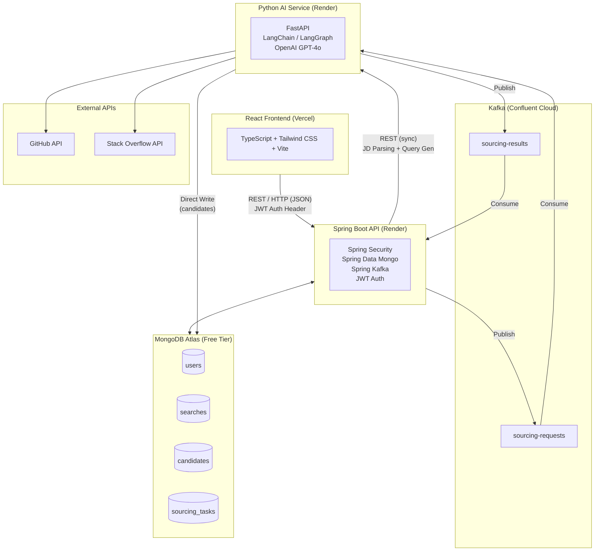
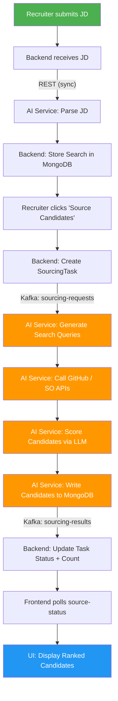
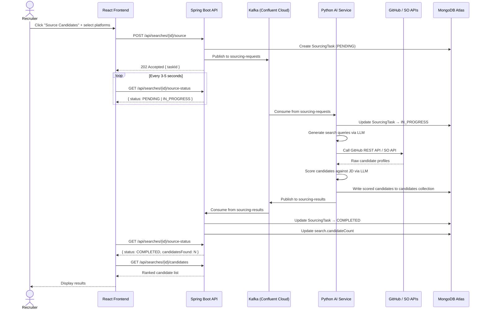
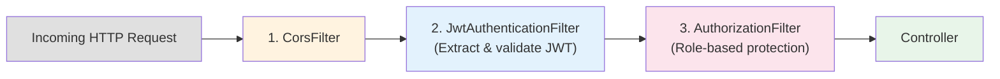
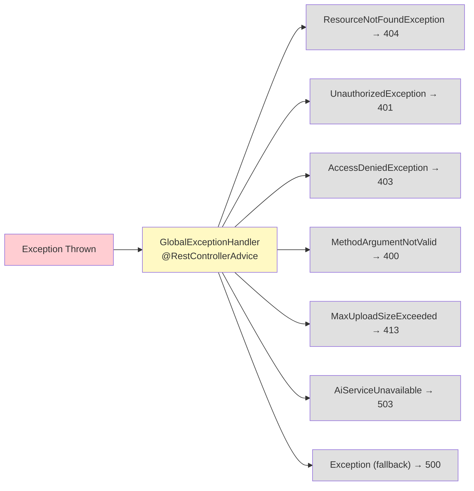
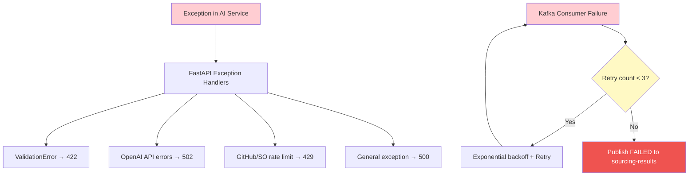
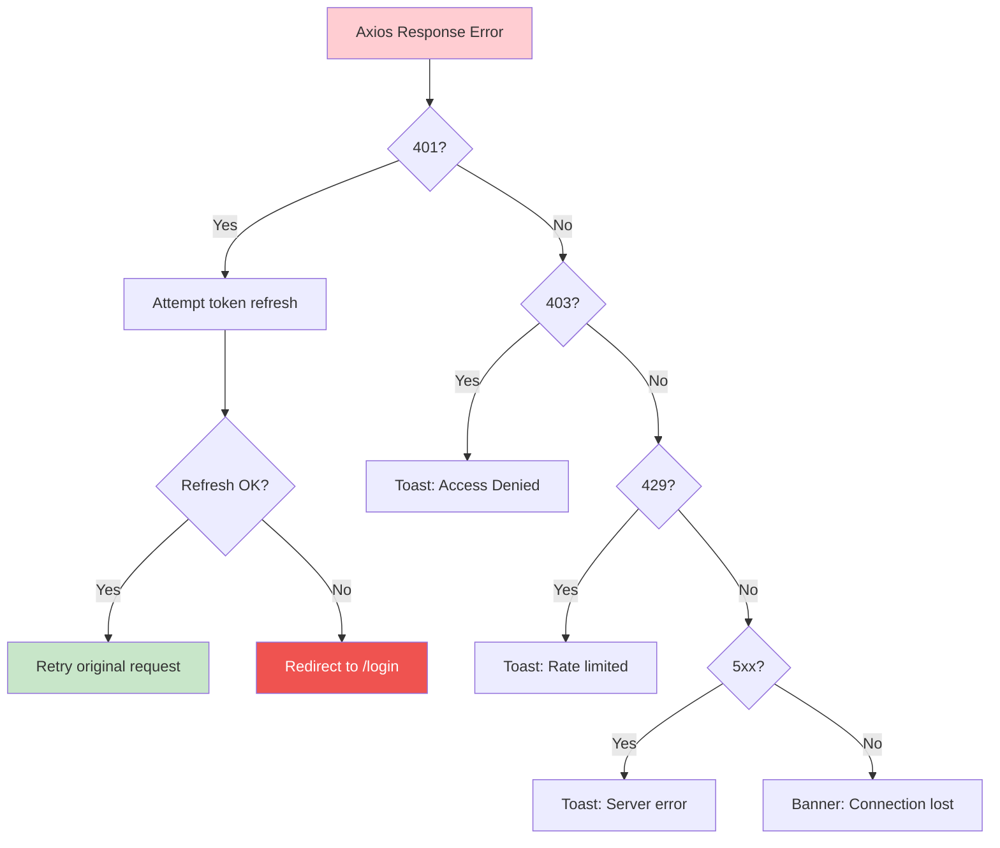

# TalentLens — Technical Architecture Design

---

## 1. System Overview

TalentLens is a multi-service application that enables recruiters to submit job descriptions, automatically parse them using AI, source candidates from public platforms (GitHub, Stack Overflow), score them for relevance, and export structured results.

### Tech Stack

| Layer | Technology |
|-------|-----------|
| Frontend | React 18 + TypeScript + Tailwind CSS (Vite) |
| Backend API | Java 17 + Spring Boot 3 + Spring Security + Spring Data MongoDB + Spring Kafka |
| AI Service | Python 3.11 + FastAPI + LangChain / LangGraph + OpenAI API |
| Database | MongoDB Atlas (Free Tier) |
| Message Broker | Apache Kafka (Confluent Cloud — Free Tier) |
| Deployment | Vercel (frontend), Render (backend + AI service), MongoDB Atlas, Confluent Cloud |

### Communication Pattern

- **REST (synchronous)** — Authentication, JD parsing, CRUD operations, candidate listing, exports
- **Kafka (asynchronous)** — Candidate sourcing pipeline (long-running, decoupled)

---

## 2. High-Level Architecture



### Data Flow Summary



---

## 3. User Roles & Permissions

| Action | RECRUITER | HIRING_MANAGER |
|--------|-----------|----------------|
| Register / Login | ✅ | ✅ |
| Create Search (submit JD) | ✅ | ❌ |
| View Own Searches | ✅ | — |
| View Shared Searches | — | ✅ |
| View Recruiters | — | ✅ |
| Request Search Access | — | ✅ |
| Review Share Requests | ✅ | ❌ |
| Approve/Reject Share Request | ✅ | ❌ |
| Trigger Candidate Sourcing | ✅ | ❌ |
| Re-search Candidates | ✅ | ❌ |
| View Candidates | ✅ | ✅ |
| Delete Candidate | ✅ | ❌ |
| Delete Search | ✅ | ❌ |
| Export Candidates (CSV/JSON) | ✅ | ✅ |
| Filter / Sort / Search | ✅ | ✅ |

---

## 4. MongoDB Schema Design

### 4.1 `users` Collection

```json
{
  "_id": "ObjectId",
  "email": "string (unique, indexed)",
  "password": "string (BCrypt hashed)",
  "name": "string",
  "role": "RECRUITER | HIRING_MANAGER",
  "createdAt": "ISODate",
  "updatedAt": "ISODate"
}
```

**Indexes:** `{ email: 1 }` (unique)

### 4.2 `searches` Collection

```json
{
  "_id": "ObjectId",
  "userId": "ObjectId (indexed)",
  "title": "string (auto-generated from JD summary)",
  "rawJdText": "string",
  "jdFileName": "string | null",
  "parsedJd": {
    "skills": ["string"],
    "responsibilities": ["string"],
    "experienceLevel": "string",
    "qualifications": ["string"],
    "technologies": ["string"],
    "domain": "string",
    "summary": "string"
  },
  "sourcingStatus": "IDLE | IN_PROGRESS | COMPLETED | FAILED",
  "sourcingPlatforms": ["GITHUB", "STACKOVERFLOW"],
  "candidateCount": "number",
  "sharedWith": ["ObjectId (userId)"],
  "createdAt": "ISODate",
  "updatedAt": "ISODate"
}
```

**Indexes:** `{ userId: 1 }`, `{ createdAt: -1 }`, `{ "sharedWith": 1 }`

### 4.3 `candidates` Collection

```json
{
  "_id": "ObjectId",
  "searchId": "ObjectId (indexed)",
  "name": "string",
  "email": "string | null",
  "avatarUrl": "string | null",
  "profileUrl": "string",
  "source": "GITHUB | STACKOVERFLOW",
  "sourceUsername": "string",
  "skills": ["string"],
  "bio": "string | null",
  "location": "string | null",
  "experience": "string | null",
  "matchScore": "number (0-100)",
  "scoreBreakdown": {
    "skillMatch": "number (0-100)",
    "experienceMatch": "number (0-100)",
    "overallFit": "number (0-100)"
  },
  "sourcedAt": "ISODate",
  "isActive": "boolean (default: true)",
  "createdAt": "ISODate"
}
```

**Indexes:** `{ searchId: 1, isActive: 1 }`, `{ searchId: 1, source: 1, sourceUsername: 1 }` (unique — deduplication), `{ matchScore: -1 }`

### 4.4 `sourcing_tasks` Collection

```json
{
  "_id": "ObjectId",
  "searchId": "ObjectId (indexed)",
  "platforms": ["GITHUB", "STACKOVERFLOW"],
  "status": "PENDING | IN_PROGRESS | COMPLETED | FAILED",
  "candidatesFound": "number",
  "error": "string | null",
  "startedAt": "ISODate",
  "completedAt": "ISODate | null"
}
```

**Indexes:** `{ searchId: 1 }`, `{ status: 1 }`

### 4.5 `share_requests` Collection

```json
{
  "_id": "ObjectId",
  "searchId": "ObjectId (indexed)",
  "requesterUserId": "ObjectId (HIRING_MANAGER)",
  "ownerUserId": "ObjectId (RECRUITER, indexed)",
  "status": "PENDING | APPROVED | REJECTED",
  "requestedAt": "ISODate",
  "resolvedAt": "ISODate | null",
  "resolvedBy": "ObjectId | null",
  "note": "string | null"
}
```

**Indexes:**
- `{ ownerUserId: 1, status: 1, requestedAt: -1 }` (incoming request queue for recruiter)
- `{ requesterUserId: 1, requestedAt: -1 }` (request history for hiring manager)
- `{ searchId: 1, requesterUserId: 1, status: 1 }` (fast duplicate pending checks)

---

## 5. API Design

### 5.1 Authentication Endpoints (Public)

| Method | Endpoint | Description | Request Body | Response |
|--------|----------|-------------|-------------|----------|
| POST | `/api/auth/register` | Register new user | `{ name, email, password, role }` | `{ userId, name, email, role }` |
| POST | `/api/auth/login` | Login | `{ email, password }` | `{ accessToken, refreshToken, user }` |
| POST | `/api/auth/refresh` | Refresh access token | `{ refreshToken }` | `{ accessToken }` |
| GET | `/api/auth/me` | Get current user profile | — | `{ userId, name, email, role }` |

### 5.2 Search Endpoints (Authenticated)

| Method | Endpoint | Description | Auth |
|--------|----------|-------------|------|
| POST | `/api/searches` | Create new search (JD text or file upload) | RECRUITER |
| GET | `/api/searches` | List searches with filters | RECRUITER, HIRING_MANAGER |
| GET | `/api/searches/{id}` | Get search detail with parsed JD | RECRUITER, HIRING_MANAGER |
| DELETE | `/api/searches/{id}` | Delete search + associated candidates | RECRUITER |
| POST | `/api/searches/{id}/source` | Trigger candidate sourcing | RECRUITER |
| GET | `/api/searches/{id}/source-status` | Poll sourcing task status | RECRUITER, HIRING_MANAGER |

**POST `/api/searches`** — Create Search

```
Content-Type: multipart/form-data

Fields:
  - jdText: string (optional — raw JD text)
  - jdFile: file (optional — .txt, .pdf, .docx)
  // One of jdText or jdFile is required

Response: 201 Created
{
  "id": "string",
  "title": "string",
  "parsedJd": { ... },
  "sourcingStatus": "IDLE",
  "createdAt": "ISO timestamp"
}
```

**Flow:** Backend receives JD → calls Python AI `POST /ai/parse-jd` synchronously → stores search with parsed result → returns to frontend.

**GET `/api/searches`** — List Searches

```
Query Parameters:
  - keyword: string (searches title, rawJdText)
  - status: IDLE | IN_PROGRESS | COMPLETED | FAILED
  - dateFrom: ISO date
  - dateTo: ISO date
  - sortBy: createdAt | candidateCount | title (default: createdAt)
  - sortOrder: asc | desc (default: desc)
  - page: number (default: 0)
  - size: number (default: 10)

Response: 200 OK
{
  "content": [ { search objects } ],
  "totalElements": number,
  "totalPages": number,
  "page": number,
  "size": number
}
```

**POST `/api/searches/{id}/source`** — Trigger Sourcing

```json
Request Body:
{
  "platforms": ["GITHUB", "STACKOVERFLOW"]
}

Response: 202 Accepted
{
  "taskId": "string",
  "status": "PENDING",
  "message": "Sourcing started. Poll /source-status for updates."
}
```

**GET `/api/searches/{id}/source-status`** — Poll Status

```json
Response: 200 OK
{
  "taskId": "string",
  "status": "PENDING | IN_PROGRESS | COMPLETED | FAILED",
  "candidatesFound": number,
  "error": "string | null",
  "startedAt": "ISO timestamp",
  "completedAt": "ISO timestamp | null"
}
```

### 5.3 Candidate Endpoints (Authenticated)

| Method | Endpoint | Description | Auth |
|--------|----------|-------------|------|
| GET | `/api/searches/{id}/candidates` | List candidates with filters | RECRUITER, HIRING_MANAGER |
| DELETE | `/api/searches/{id}/candidates/{candidateId}` | Soft-delete candidate | RECRUITER |
| GET | `/api/searches/{id}/candidates/export` | Export as CSV or JSON | RECRUITER, HIRING_MANAGER |

**GET `/api/searches/{id}/candidates`** — List Candidates

```
Query Parameters:
  - skill: string (comma-separated, matches any)
  - source: GITHUB | STACKOVERFLOW
  - minScore: number (0-100)
  - maxScore: number (0-100)
  - keyword: string (searches name, bio, sourceUsername)
  - sortBy: matchScore | name | sourcedAt (default: matchScore)
  - sortOrder: asc | desc (default: desc)
  - page: number (default: 0)
  - size: number (default: 20)

Response: 200 OK
{
  "content": [
    {
      "id": "string",
      "name": "string",
      "email": "string | null",
      "avatarUrl": "string | null",
      "profileUrl": "string",
      "source": "GITHUB",
      "sourceUsername": "octocat",
      "skills": ["Java", "Spring Boot"],
      "bio": "string",
      "location": "San Francisco",
      "matchScore": 87,
      "scoreBreakdown": {
        "skillMatch": 92,
        "experienceMatch": 78,
        "overallFit": 87
      },
      "sourcedAt": "ISO timestamp"
    }
  ],
  "totalElements": number,
  "totalPages": number,
  "page": number,
  "size": number
}
```

**GET `/api/searches/{id}/candidates/export?format=csv|json`** — Export

```
Query Parameters:
  - format: csv | json (required)
  - All filter params from candidate listing (optional — export filtered subset)

Response:
  - CSV: Content-Type: text/csv, Content-Disposition: attachment
  - JSON: Content-Type: application/json, Content-Disposition: attachment
```

### 5.4 Share Request Endpoints (Authenticated)

| Method | Endpoint | Description | Auth |
|--------|----------|-------------|------|
| GET | `/api/share-requests/recruiters` | List recruiters for selection | HIRING_MANAGER |
| POST | `/api/share-requests` | Request access to a recruiter's search | HIRING_MANAGER |
| GET | `/api/share-requests/incoming` | List pending incoming requests | RECRUITER |
| GET | `/api/share-requests/outgoing` | List requester history | HIRING_MANAGER |
| POST | `/api/share-requests/{id}/approve` | Approve and share search | RECRUITER |
| POST | `/api/share-requests/{id}/reject` | Reject request | RECRUITER |

**POST `/api/share-requests`** — Create Request

```json
Request Body:
{
  "searchId": "string",
  "recruiterUserId": "string",
  "note": "Can I review this role?"
}

Response: 201 Created
{
  "id": "string",
  "searchId": "string",
  "requesterUserId": "string",
  "ownerUserId": "string",
  "status": "PENDING",
  "requestedAt": "ISO timestamp"
}
```

Validation rules:
- `recruiterUserId` must match the owner of `searchId`
- requester role must be `HIRING_MANAGER`
- duplicate pending request for the same (`searchId`, `requesterUserId`) is rejected with 409

**POST `/api/share-requests/{id}/approve`** — Approve Request

```json
Response: 200 OK
{
  "id": "string",
  "status": "APPROVED",
  "resolvedAt": "ISO timestamp"
}
```

Approve flow:
1. Ensure request belongs to authenticated recruiter (`ownerUserId`)
2. Update request status to `APPROVED`
3. Add `requesterUserId` to `search.sharedWith` (idempotent add)
4. Persist both updates

### 5.5 AI Service Internal Endpoints

These endpoints are called by the Spring Boot backend only (not exposed to frontend).

| Method | Endpoint | Description |
|--------|----------|-------------|
| POST | `/ai/parse-jd` | Parse raw JD text into structured format |
| POST | `/ai/generate-queries` | Generate platform-specific search queries |

**POST `/ai/parse-jd`**

```json
Request:
{
  "jdText": "We are looking for a Senior Java Developer..."
}

Response:
{
  "skills": ["Java", "Spring Boot", "Microservices", "REST APIs"],
  "responsibilities": ["Design scalable backend systems", "Mentor junior developers"],
  "experienceLevel": "Senior (5-8 years)",
  "qualifications": ["B.S. in Computer Science or equivalent"],
  "technologies": ["Java 17", "Spring Boot 3", "PostgreSQL", "Docker", "Kubernetes"],
  "domain": "FinTech",
  "summary": "Senior Java Developer for a FinTech platform, building scalable microservices..."
}
```

**POST `/ai/generate-queries`**

```json
Request:
{
  "parsedJd": { ... },
  "platforms": ["GITHUB", "STACKOVERFLOW"]
}

Response:
{
  "github": {
    "queries": [
      "language:java topic:spring-boot location:remote followers:>10",
      "language:java topic:microservices topic:fintech"
    ],
    "userSearchQueries": [
      "java spring boot senior developer",
      "java microservices fintech"
    ]
  },
  "stackoverflow": {
    "tags": ["java", "spring-boot", "microservices"],
    "minReputation": 1000
  }
}
```

---

## 6. Kafka Messaging Design

### 6.1 Topics

| Topic | Producer | Consumer | Purpose |
|-------|----------|----------|---------|
| `sourcing-requests` | Spring Boot Backend | Python AI Service | Trigger candidate sourcing job |
| `sourcing-results` | Python AI Service | Spring Boot Backend | Report sourcing completion |

### 6.2 Message Schemas

**`sourcing-requests` Message**

```json
{
  "taskId": "string (sourcing_tasks._id)",
  "searchId": "string (searches._id)",
  "parsedJd": {
    "skills": ["string"],
    "responsibilities": ["string"],
    "experienceLevel": "string",
    "qualifications": ["string"],
    "technologies": ["string"],
    "domain": "string"
  },
  "platforms": ["GITHUB", "STACKOVERFLOW"],
  "timestamp": "ISO timestamp"
}
```

**`sourcing-results` Message**

```json
{
  "taskId": "string",
  "searchId": "string",
  "status": "COMPLETED | FAILED",
  "candidatesFound": "number",
  "error": "string | null",
  "completedAt": "ISO timestamp"
}
```

### 6.3 End-to-End Sourcing Flow



### 6.4 Re-Search Flow

When a recruiter triggers "Re-search" on an existing search:

1. A **new** `SourcingTask` is created (the old one is preserved for history)
2. Same Kafka flow executes
3. New candidates are **appended** to the existing list
4. **Deduplication** is enforced via the unique compound index `{ searchId, source, sourceUsername }` — duplicates are skipped (upsert)
5. `search.candidateCount` is updated to reflect total active candidates

---

## 7. AI / LLM Design

### 7.1 JD Parsing (LangChain)

```
Model:        GPT-4o-mini (cost-efficient for structured extraction)
Framework:    LangChain with PydanticOutputParser
Temperature:  0.0 (deterministic extraction)

System Prompt:
  "You are an expert recruiter assistant. Extract structured information
   from the following job description. Return ONLY the JSON matching
   the provided schema. Do not invent information not present in the JD."

Input:   Raw JD text (string)
Output:  ParsedJd (Pydantic model → JSON)
```

### 7.2 Search Query Generation (LangChain)

```
Model:        GPT-4o-mini
Framework:    LangChain with StructuredOutputParser

Input:   ParsedJd + target platforms
Output:  Platform-specific query objects

GitHub Query Strategy:
  - User search API: location, language, followers filters
  - Repository search: topic-based discovery → extract contributors
  - Bio keyword matching

Stack Overflow Query Strategy:
  - Tag-based user search (top answerers by tag)
  - Reputation threshold filtering
  - Activity recency filtering
```

### 7.3 Candidate Scoring (LangGraph Agent)

```
Model:        GPT-4o (higher quality for nuanced scoring)
Framework:    LangGraph (multi-step agent with state)
Temperature:  0.1

Agent Steps:
  1. SKILL_MATCH    — Compare candidate skills against JD required skills
  2. EXPERIENCE_FIT — Assess experience level alignment (years, seniority)
  3. OVERALL_SCORE  — Synthesize final score considering domain fit, activity level

Input:   Candidate profile + ParsedJd
Output:  { matchScore: 0-100, scoreBreakdown: { skillMatch, experienceMatch, overallFit } }

Batch Processing:
  - Group candidates (batch of 5) per LLM call to reduce API costs
  - Parallel processing of batches using asyncio
```

### 7.4 LLM Cost Estimation (MVP)

| Operation | Model | Est. Tokens/Call | Calls/Search | Cost/Search |
|-----------|-------|-----------------|--------------|-------------|
| JD Parsing | GPT-4o-mini | ~2,000 | 1 | ~$0.001 |
| Query Generation | GPT-4o-mini | ~1,500 | 1 | ~$0.001 |
| Candidate Scoring | GPT-4o | ~3,000 | ~10 (batched) | ~$0.15 |
| **Total per search** | | | | **~$0.15** |

---

## 8. Authentication & Security

### 8.1 JWT Authentication Flow

```mermaid
sequenceDiagram
    participant FE as React Frontend
    participant BE as Spring Boot API
    participant DB as MongoDB Atlas

    Note over FE,DB: Login Flow
    FE->>BE: POST /api/auth/login { email, password }
    BE->>DB: Find user by email
    DB-->>BE: User document
    BE->>BE: Verify BCrypt password
    BE->>BE: Generate JWT access token (15 min)
    BE->>BE: Generate JWT refresh token (7 days)
    BE-->>FE: { accessToken, refreshToken, user }

    Note over FE,DB: Authenticated Request
    FE->>BE: GET /api/searches<br/>Authorization: Bearer &lt;token&gt;
    BE->>BE: JwtAuthFilter validates token
    BE->>BE: Extract userId + role
    BE->>BE: Set SecurityContext
    BE->>DB: Query searches
    DB-->>BE: Search results
    BE-->>FE: 200 OK { searches }

    Note over FE,DB: Token Refresh
    FE->>BE: POST /api/auth/refresh { refreshToken }
    BE->>BE: Validate refresh token
    BE->>BE: Generate new access token
    BE-->>FE: { accessToken }
```

### 8.2 Spring Security Configuration



**Public Endpoints (no auth required):**
- `POST /api/auth/register`
- `POST /api/auth/login`
- `POST /api/auth/refresh`

**Role-Restricted Endpoints:**
- `POST /api/searches` → RECRUITER only
- `DELETE /api/searches/{id}` → RECRUITER only
- `POST /api/searches/{id}/source` → RECRUITER only
- `DELETE /api/searches/{id}/candidates/{cid}` → RECRUITER only
- `GET /api/share-requests/recruiters` → HIRING_MANAGER only
- `POST /api/share-requests` → HIRING_MANAGER only
- `GET /api/share-requests/incoming` → RECRUITER only
- `POST /api/share-requests/{id}/approve` → RECRUITER only
- `POST /api/share-requests/{id}/reject` → RECRUITER only

**All Other Endpoints:** Authenticated (any role)

### 8.3 Security Measures

| Concern | Mitigation |
|---------|-----------|
| Password Storage | BCrypt with strength 12 |
| Token Security | Short-lived access tokens (15 min), refresh rotation |
| Token Storage (Frontend) | httpOnly cookie preferred; fallback to localStorage with XSS precautions |
| CORS | Restricted to frontend domain origin only |
| Input Validation | Jakarta Bean Validation on all DTOs (`@NotBlank`, `@Email`, `@Size`) |
| Rate Limiting | Rate limit on `/api/auth/*` endpoints (e.g., 5 login attempts per minute) |
| API Keys | OpenAI key, GitHub token stored as environment variables — never in code |
| Database | MongoDB Atlas enforces TLS by default |
| File Upload | Validate file type (`.txt`, `.pdf`, `.docx`) and max size (5MB) |
| Internal AI Service | Not exposed publicly — called only from backend via internal network |
| Soft Delete | Candidates are soft-deleted (`isActive: false`) — recoverable |

---

## 9. Frontend Architecture

### 9.1 Routing

```
/login                         → LoginPage (public)
/register                      → RegisterPage (public)
/dashboard                     → DashboardPage — list of searches (protected)
/searches/new                  → NewSearchPage — JD input + parsing (protected, RECRUITER)
/searches/:id                  → SearchDetailPage — parsed JD + candidates (protected)
```

### 9.2 Page Breakdown

#### LoginPage `/login`
- Email + password form
- "Don't have an account? Register" link
- On success: store tokens, redirect to `/dashboard`

#### RegisterPage `/register`
- Name, email, password, role (dropdown: Recruiter / Hiring Manager)
- On success: redirect to `/login`

#### DashboardPage `/dashboard`
- **Header:** "My Searches" + "New Search" button (RECRUITER only)
- **Filters bar:**
  - Keyword search (text input — searches title)
  - Status dropdown (All / Idle / In Progress / Completed / Failed)
  - Date range picker (from / to)
- **Sort:** Dropdown (Date Created / Candidate Count / Title) + asc/desc toggle
- **Search cards list:** Title, status badge, candidate count, created date, platforms used
- **Pagination:** Page size selector + page navigation

#### NewSearchPage `/searches/new`
- **JD Input section:**
  - Textarea for pasting JD text
  - OR file upload button (`.txt`, `.pdf`, `.docx`)
  - "Analyse JD" button
- **Parsed JD Summary** (appears after analysis):
  - Skills tags, responsibilities list, experience level, qualifications, technologies, domain
  - "Edit" option to re-submit
- **Source Candidates section** (appears after parsing):
  - Platform selection: checkboxes for GitHub, Stack Overflow
  - "Source Candidates" button
  - Status indicator (polling animation while sourcing)
- **Redirect** to `/searches/:id` once sourcing starts

#### SearchDetailPage `/searches/:id`
- **Parsed JD panel** (collapsible): skills, responsibilities, experience level, etc.
- **Actions bar:**
  - "Re-search Candidates" button (RECRUITER) — triggers new sourcing, appends results
  - "Export CSV" / "Export JSON" buttons
  - Sourcing status indicator
- **Candidates section:**
  - **Filter bar:**
    - Skill filter (multi-select chips)
    - Source filter (GitHub / Stack Overflow / All)
    - Match score range slider (0–100)
    - Keyword search (name, bio, username)
  - **Sort:** Match Score (default, desc) / Name / Sourced Date
  - **Candidate cards:**
    - Avatar image (or placeholder)
    - Name + source badge (GitHub icon / SO icon)
    - Profile link (external, opens in new tab)
    - Source username / tag
    - Skills (tag chips)
    - Match score (color-coded badge: green ≥70, yellow 40-69, red <40)
    - Score breakdown tooltip (skill / experience / overall)
    - Location
    - Sourced date
    - Delete button (RECRUITER — soft delete with confirmation)
  - **Pagination**

### 9.3 Component Hierarchy

```mermaid
flowchart TD
    App["App"]
    App --> AuthCtx["AuthContext (provider)"]
    App --> PL["PublicLayout"]
    App --> PRL["ProtectedLayout"]

    PL --> Login["LoginPage"]
    PL --> Register["RegisterPage"]

    PRL --> Nav["Navbar"]
    PRL --> Dash["DashboardPage"]
    PRL --> NewS["NewSearchPage"]
    PRL --> Detail["SearchDetailPage"]

    Dash --> SF["SearchFilters"]
    Dash --> SSB["SearchSortBar"]
    Dash --> SC["SearchCard (list)"]
    Dash --> P1["Pagination"]

    NewS --> JIF["JdInputForm"]
    JIF --> JTA["JdTextarea"]
    JIF --> JFU["JdFileUpload"]
    NewS --> PJS["ParsedJdSummary"]
    NewS --> PS["PlatformSelector"]
    NewS --> SSI["SourcingStatusIndicator"]

    Detail --> PJP["ParsedJdPanel (collapsible)"]
    Detail --> CA["CandidateActions (re-search, export)"]
    Detail --> CF["CandidateFilters"]
    CF --> SMS["SkillMultiSelect"]
    CF --> SoF["SourceFilter"]
    CF --> SRS["ScoreRangeSlider"]
    CF --> KS["KeywordSearch"]
    Detail --> CSB["CandidateSortBar"]
    Detail --> CC["CandidateCard (list)"]
    CC --> AB["AvatarBadge"]
    CC --> MSB["MatchScoreBadge"]
    CC --> ST["SkillTags"]
    CC --> DB2["DeleteButton"]
    Detail --> P2["Pagination"]

    style App fill:#1a1a2e,color:#fff
    style PL fill:#16213e,color:#fff
    style PRL fill:#16213e,color:#fff
    style Dash fill:#0f3460,color:#fff
    style NewS fill:#0f3460,color:#fff
    style Detail fill:#0f3460,color:#fff
```



### 9.4 State Management

| Concern | Approach |
|---------|----------|
| Auth state (tokens, user) | React Context (`AuthContext`) |
| Server data (searches, candidates) | React Query / TanStack Query (caching, refetch, pagination) |
| Filter & sort state | URL search params (shareable, bookmarkable) |
| Sourcing polling | Custom `useSourcingStatus` hook with `setInterval` + auto-stop on completion |
| UI state (modals, toasts) | Local component state |

### 9.5 Key Custom Hooks

```typescript
useAuth()               // Login, logout, register, token refresh
useSearches(filters)    // Paginated search list with filters
useSearch(id)           // Single search detail
useCandidates(id, filters) // Paginated candidates with filters
useSourcingStatus(id)   // Poll sourcing task status (3s interval)
useExport(id, format)   // Trigger CSV/JSON download
```

---

## 10. Project Directory Structure

```
TalentLens/
│
├── talentlens-ui/                         # React Frontend
│   ├── public/
│   ├── src/
│   │   ├── api/                           # Axios instance + API clients
│   │   │   ├── axiosInstance.ts           # Base config, interceptors, token refresh
│   │   │   ├── authApi.ts
│   │   │   ├── searchApi.ts
│   │   │   └── candidateApi.ts
│   │   ├── components/
│   │   │   ├── auth/
│   │   │   │   ├── LoginForm.tsx
│   │   │   │   └── RegisterForm.tsx
│   │   │   ├── layout/
│   │   │   │   ├── Navbar.tsx
│   │   │   │   ├── ProtectedRoute.tsx
│   │   │   │   └── PublicRoute.tsx
│   │   │   ├── search/
│   │   │   │   ├── JdInputForm.tsx
│   │   │   │   ├── JdFileUpload.tsx
│   │   │   │   ├── ParsedJdSummary.tsx
│   │   │   │   ├── PlatformSelector.tsx
│   │   │   │   ├── SearchCard.tsx
│   │   │   │   ├── SearchFilters.tsx
│   │   │   │   └── SourcingStatusIndicator.tsx
│   │   │   ├── candidate/
│   │   │   │   ├── CandidateCard.tsx
│   │   │   │   ├── CandidateFilters.tsx
│   │   │   │   ├── MatchScoreBadge.tsx
│   │   │   │   ├── SkillTags.tsx
│   │   │   │   └── ExportButton.tsx
│   │   │   └── common/
│   │   │       ├── Pagination.tsx
│   │   │       ├── SortBar.tsx
│   │   │       ├── LoadingSpinner.tsx
│   │   │       └── ConfirmDialog.tsx
│   │   ├── pages/
│   │   │   ├── LoginPage.tsx
│   │   │   ├── RegisterPage.tsx
│   │   │   ├── DashboardPage.tsx
│   │   │   ├── NewSearchPage.tsx
│   │   │   └── SearchDetailPage.tsx
│   │   ├── hooks/
│   │   │   ├── useAuth.ts
│   │   │   ├── useSearches.ts
│   │   │   ├── useSearch.ts
│   │   │   ├── useCandidates.ts
│   │   │   ├── useSourcingStatus.ts
│   │   │   └── useExport.ts
│   │   ├── context/
│   │   │   └── AuthContext.tsx
│   │   ├── types/
│   │   │   ├── auth.ts
│   │   │   ├── search.ts
│   │   │   ├── candidate.ts
│   │   │   └── common.ts
│   │   ├── utils/
│   │   │   ├── constants.ts
│   │   │   └── formatters.ts
│   │   ├── App.tsx
│   │   └── main.tsx
│   ├── index.html
│   ├── tailwind.config.js
│   ├── tsconfig.json
│   ├── vite.config.ts
│   ├── Dockerfile
│   └── package.json
│
├── talentlens-backend/                    # Java Spring Boot
│   ├── src/
│   │   ├── main/
│   │   │   ├── java/com/talentlens/
│   │   │   │   ├── TalentLensApplication.java
│   │   │   │   ├── config/
│   │   │   │   │   ├── SecurityConfig.java
│   │   │   │   │   ├── KafkaConfig.java
│   │   │   │   │   ├── CorsConfig.java
│   │   │   │   │   └── MongoConfig.java
│   │   │   │   ├── controller/
│   │   │   │   │   ├── AuthController.java
│   │   │   │   │   ├── SearchController.java
│   │   │   │   │   └── CandidateController.java
│   │   │   │   ├── service/
│   │   │   │   │   ├── AuthService.java
│   │   │   │   │   ├── SearchService.java
│   │   │   │   │   ├── CandidateService.java
│   │   │   │   │   ├── SourcingService.java
│   │   │   │   │   ├── AiServiceClient.java
│   │   │   │   │   └── ExportService.java
│   │   │   │   ├── repository/
│   │   │   │   │   ├── UserRepository.java
│   │   │   │   │   ├── SearchRepository.java
│   │   │   │   │   ├── CandidateRepository.java
│   │   │   │   │   └── SourcingTaskRepository.java
│   │   │   │   ├── model/
│   │   │   │   │   ├── User.java
│   │   │   │   │   ├── Search.java
│   │   │   │   │   ├── Candidate.java
│   │   │   │   │   ├── SourcingTask.java
│   │   │   │   │   ├── ParsedJd.java
│   │   │   │   │   └── ScoreBreakdown.java
│   │   │   │   ├── dto/
│   │   │   │   │   ├── request/
│   │   │   │   │   │   ├── LoginRequest.java
│   │   │   │   │   │   ├── RegisterRequest.java
│   │   │   │   │   │   ├── RefreshTokenRequest.java
│   │   │   │   │   │   └── SourcingRequest.java
│   │   │   │   │   └── response/
│   │   │   │   │       ├── AuthResponse.java
│   │   │   │   │       ├── SearchResponse.java
│   │   │   │   │       ├── CandidateResponse.java
│   │   │   │   │       ├── SourcingStatusResponse.java
│   │   │   │   │       └── PageResponse.java
│   │   │   │   ├── security/
│   │   │   │   │   ├── JwtTokenProvider.java
│   │   │   │   │   ├── JwtAuthenticationFilter.java
│   │   │   │   │   └── UserDetailsServiceImpl.java
│   │   │   │   ├── kafka/
│   │   │   │   │   ├── SourcingRequestProducer.java
│   │   │   │   │   └── SourcingResultConsumer.java
│   │   │   │   └── exception/
│   │   │   │       ├── GlobalExceptionHandler.java
│   │   │   │       ├── ResourceNotFoundException.java
│   │   │   │       └── UnauthorizedException.java
│   │   │   └── resources/
│   │   │       └── application.yml
│   │   └── test/
│   ├── Dockerfile
│   └── pom.xml
│
├── talentlens-ai/                         # Python AI Service
│   ├── app/
│   │   ├── __init__.py
│   │   ├── main.py                        # FastAPI entrypoint
│   │   ├── config.py                      # Settings (env vars)
│   │   ├── api/
│   │   │   ├── __init__.py
│   │   │   ├── jd_parser.py              # POST /ai/parse-jd
│   │   │   └── query_generator.py        # POST /ai/generate-queries
│   │   ├── services/
│   │   │   ├── __init__.py
│   │   │   ├── github_service.py         # GitHub REST API client
│   │   │   ├── stackoverflow_service.py  # Stack Overflow API client
│   │   │   └── scoring_service.py        # LLM-based candidate scoring
│   │   ├── agents/
│   │   │   ├── __init__.py
│   │   │   ├── jd_parser_chain.py        # LangChain: JD parsing chain
│   │   │   ├── query_gen_chain.py        # LangChain: Query generation chain
│   │   │   └── scoring_agent.py          # LangGraph: Multi-step scoring agent
│   │   ├── kafka/
│   │   │   ├── __init__.py
│   │   │   ├── consumer.py               # sourcing-requests consumer
│   │   │   └── producer.py               # sourcing-results producer
│   │   ├── models/
│   │   │   ├── __init__.py
│   │   │   ├── jd_models.py              # Pydantic models for parsed JD
│   │   │   ├── candidate_models.py       # Pydantic models for candidates
│   │   │   └── kafka_models.py           # Pydantic models for Kafka messages
│   │   └── db/
│   │       ├── __init__.py
│   │       └── mongo_client.py           # pymongo connection + write ops
│   ├── requirements.txt
│   ├── Dockerfile
│   └── .env.example
│
├── docker-compose.yml                     # Local development orchestration
├── specs/
│   └── TalentLens-Architecture-Design.md
└── candidate-sourcing-tool-requirements.md
```

---

## 11. Deployment Architecture

### 11.1 Free-Tier Hosting Plan

| Service | Platform | Free Tier Limits | Notes |
|---------|----------|-----------------|-------|
| Frontend (React) | **Vercel** | Unlimited static builds, 100GB bandwidth/month | Auto-deploys from Git |
| Backend (Java) | **Render** | 750 hrs/month, 512MB RAM | Sleeps after 15min idle (~30s cold start) |
| AI Service (Python) | **Render** | 750 hrs/month, 512MB RAM | Sleeps after 15min idle (~5s cold start) |
| MongoDB | **MongoDB Atlas** | 512MB storage, shared M0 cluster | Always-on, TLS enforced |
| Kafka | **Confluent Cloud** | Basic cluster, 99.5% uptime SLA, free $400 credit | Managed Kafka, Schema Registry included |

> **Note:** For local development, Kafka runs via Docker (Confluent `cp-kafka` image) — no cloud setup needed. Confluent Cloud is used only for production deployment.

### 11.2 Environment Variables

#### Local Development (Docker Kafka)

**Spring Boot Backend**

```yaml
MONGODB_URI=mongodb://localhost:27017/talentlens
JWT_SECRET=dev-secret-key-change-in-prod
JWT_ACCESS_EXPIRY=900000
JWT_REFRESH_EXPIRY=604800000
AI_SERVICE_URL=http://localhost:8000
KAFKA_BOOTSTRAP_SERVERS=localhost:9092
CORS_ALLOWED_ORIGINS=http://localhost:3000
```

**Python AI Service**

```bash
MONGODB_URI=mongodb://localhost:27017/talentlens
OPENAI_API_KEY=sk-...
GITHUB_TOKEN=ghp_...
KAFKA_BOOTSTRAP_SERVERS=localhost:9092
```

**React Frontend**

```bash
VITE_API_BASE_URL=http://localhost:8080/api
```

#### Production (Confluent Cloud + MongoDB Atlas)

**Spring Boot Backend**

```yaml
MONGODB_URI=mongodb+srv://<user>:<pass>@cluster.mongodb.net/talentlens
JWT_SECRET=<random-256-bit-secret>
JWT_ACCESS_EXPIRY=900000        # 15 minutes in ms
JWT_REFRESH_EXPIRY=604800000    # 7 days in ms
AI_SERVICE_URL=https://talentlens-ai.onrender.com
KAFKA_BOOTSTRAP_SERVERS=<confluent-bootstrap-server>
KAFKA_SASL_USERNAME=<confluent-api-key>
KAFKA_SASL_PASSWORD=<confluent-api-secret>
KAFKA_SECURITY_PROTOCOL=SASL_SSL
KAFKA_SASL_MECHANISM=PLAIN
CORS_ALLOWED_ORIGINS=https://talentlens.vercel.app
```

**Python AI Service**

```bash
MONGODB_URI=mongodb+srv://<user>:<pass>@cluster.mongodb.net/talentlens
OPENAI_API_KEY=sk-...
GITHUB_TOKEN=ghp_...
KAFKA_BOOTSTRAP_SERVERS=<confluent-bootstrap-server>
KAFKA_SASL_USERNAME=<confluent-api-key>
KAFKA_SASL_PASSWORD=<confluent-api-secret>
KAFKA_SECURITY_PROTOCOL=SASL_SSL
KAFKA_SASL_MECHANISM=PLAIN
```

**React Frontend**

```bash
VITE_API_BASE_URL=https://talentlens-api.onrender.com/api
```

### 11.3 Docker Compose (Local Development)

Kafka runs locally in Docker via the Confluent `cp-kafka` image. No Confluent Cloud credentials are needed during development — the backend and AI service connect to `kafka:9092` (or `localhost:9092` if running services outside Docker) with `PLAINTEXT` protocol (no SASL).

```yaml
version: '3.8'

services:
  mongodb:
    image: mongo:7
    ports:
      - "27017:27017"
    volumes:
      - mongo_data:/data/db

  kafka:
    image: confluentinc/cp-kafka:7.5.0
    ports:
      - "9092:9092"
    environment:
      KAFKA_NODE_ID: 1
      KAFKA_PROCESS_ROLES: broker,controller
      KAFKA_LISTENERS: PLAINTEXT://0.0.0.0:9092,CONTROLLER://0.0.0.0:9093
      KAFKA_ADVERTISED_LISTENERS: PLAINTEXT://kafka:9092
      KAFKA_CONTROLLER_QUORUM_VOTERS: 1@kafka:9093
      KAFKA_CONTROLLER_LISTENER_NAMES: CONTROLLER
      KAFKA_OFFSETS_TOPIC_REPLICATION_FACTOR: 1

  backend:
    build: ./talentlens-backend
    ports:
      - "8080:8080"
    depends_on:
      - mongodb
      - kafka
    environment:
      MONGODB_URI: mongodb://mongodb:27017/talentlens
      AI_SERVICE_URL: http://ai-service:8000
      KAFKA_BOOTSTRAP_SERVERS: kafka:9092

  ai-service:
    build: ./talentlens-ai
    ports:
      - "8000:8000"
    depends_on:
      - mongodb
      - kafka
    environment:
      MONGODB_URI: mongodb://mongodb:27017/talentlens
      KAFKA_BOOTSTRAP_SERVERS: kafka:9092
      OPENAI_API_KEY: ${OPENAI_API_KEY}
      GITHUB_TOKEN: ${GITHUB_TOKEN}

  frontend:
    build: ./talentlens-ui
    ports:
      - "3000:3000"
    environment:
      VITE_API_BASE_URL: http://localhost:8080/api

volumes:
  mongo_data:
```

---

## 12. External API Integration

### 12.1 GitHub REST API

**Endpoints Used:**

| Endpoint | Purpose | Rate Limit (Authenticated) |
|----------|---------|---------------------------|
| `GET /search/users` | Find users by language, location, bio keywords | 30 req/min |
| `GET /users/{username}` | Get detailed profile (name, bio, avatar, email) | 5,000 req/hr |
| `GET /users/{username}/repos` | Get user's repositories (infer skills from languages) | 5,000 req/hr |

**Authentication:** Personal Access Token (PAT) via `Authorization: Bearer <token>` header.

**Strategy:**
1. Generate search queries from parsed JD (language, location, keywords)
2. Search users via `/search/users` with generated queries
3. For each matched user, fetch detailed profile and top repositories
4. Extract skills from repository languages and topics
5. Build candidate profile for scoring

### 12.2 Stack Overflow API

**Endpoints Used:**

| Endpoint | Purpose | Rate Limit |
|----------|---------|-----------|
| `GET /2.3/users` | Search users by name/reputation | 300 req/day (with key) |
| `GET /2.3/tags/{tags}/top-answerers/all_time` | Top answerers for specific tags | 300 req/day |
| `GET /2.3/users/{id}` | Detailed user profile | 300 req/day |
| `GET /2.3/users/{id}/top-tags` | User's top tags (skills) | 300 req/day |

**Authentication:** API key via query parameter `key=<api_key>` (register at stackapps.com).

**Strategy:**
1. Map parsed JD technologies/skills to Stack Overflow tags
2. Find top answerers for those tags
3. Fetch detailed profiles and top tags
4. Extract skills from tags, infer experience from reputation/badge count
5. Build candidate profile for scoring

---

## 13. Error Handling Strategy

### 13.1 Backend (Spring Boot)



All error responses follow a consistent structure: `{ error, message, timestamp }`

### 13.2 AI Service (Python)



### 13.3 Frontend (React)



---

## 14. Non-Functional Requirements

| Concern | Target (MVP) |
|---------|-------------|
| JD parsing response time | < 5 seconds |
| Candidate sourcing (20-50 candidates) | < 3 minutes |
| UI page load | < 2 seconds |
| Concurrent users | 10-20 (free tier) |
| Data retention | Indefinite (within 512MB Atlas limit) |
| Availability | Best-effort (free tier — cold starts expected) |
| Browser support | Chrome, Firefox, Safari, Edge (latest) |

---

## 15. Future Enhancements (Post-MVP)

These items are **not** in scope for MVP but are noted for future consideration:

1. **WebSocket** — Replace polling with real-time push updates for sourcing status
2. **LinkedIn integration** — When/if API access is available
3. **Candidate notes** — Recruiter can add notes to individual candidates
4. **Email outreach** — Draft outreach emails from within the tool
5. **Search templates** — Save and reuse JD templates for common roles
6. **Team collaboration** — Multiple recruiters collaborating on the same search
7. **Analytics dashboard** — Sourcing metrics, conversion rates, time-to-fill
8. **Candidate history** — Track if a candidate appeared in multiple searches
9. **Custom scoring weights** — Let recruiter adjust skill vs. experience weighting
10. **Redis caching** — Cache GitHub/SO profiles to reduce API calls and improve speed
